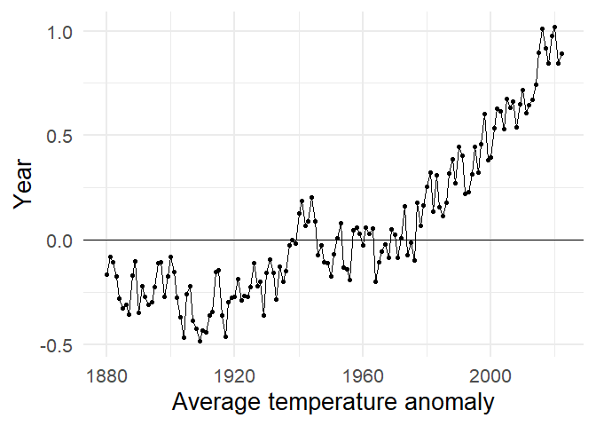

<!-- README.md is generated from README.Rmd. Please edit that file -->

# globalTemp

<!-- badges: start -->
<!-- badges: end -->

globalTemp is a data package that is meant to provide access to the data
used for creating the famous climate spiral video, released by NASA.


This vizualisation shows monthly global temperature anomalies between
the years 1880 and 2021. Anomalies are calculated as the differences
between the measured temperatured and the average temperature for period
1951 to 1980. Blues indicate cooler temperatures, while reds show warmer
temperatures. It is famous because it shows clearly the impact of
man-made climate change on the global temperature.

## Installation

You can install the released version of globalTemp from
[CRAN](https://CRAN.R-project.org) with:

``` r
install.packages("globalTemp")
```

And the development version from [GitHub](https://github.com/) with:

``` r
# install.packages("devtools")
devtools::install_github("ABohynDOE/globalTemp")
```

## Example

This is a basic example that shows you how to build a graph of the
temperature change, using the package:

``` r
library(globalTemp)
library(ggplot2)
library(dplyr)
#> 
#> Attaching package: 'dplyr'
#> The following objects are masked from 'package:stats':
#> 
#>     filter, lag
#> The following objects are masked from 'package:base':
#> 
#>     intersect, setdiff, setequal, union

global %>%
  group_by(year) %>%
  summarise(mean_temp = mean(temperature)) %>%
  ggplot(aes(x = year, y = mean_temp)) +
  geom_point() +
  geom_line() +
  geom_hline(yintercept = 0) +
  labs(
    x = "Average temperature anomaly",
    y = "Year"
  ) +
  theme_minimal(base_size = 20)
```


